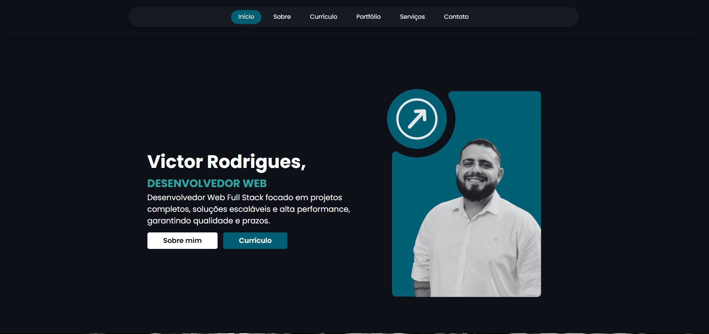

# Portfólio Pessoal - Frontend Estático
Projeto pessoal de portfólio desenvolvido com HTML5, CSS3 e JavaScript vanilla.

Objetivo: apresentar informações profissionais, projetos, habilidades e contato direto via link para email/WhatsApp.

## 🚀 Tecnologias Utilizadas

  
  
  
  

- HTML5 sem frameworks  
- CSS modularizado 
- JavaScript vanilla para interatividade e animações
- Layout responsivo para dispositivos móveis e desktop  
- Carrossel responsivo com Swiper

## 📄 Licença  

Este projeto está sob a licença MIT. Consulte o arquivo [LICENSE](./LICENSE) para mais detalhes.  

---

## 🧑‍💻 Autor

  
  
  
  
  
